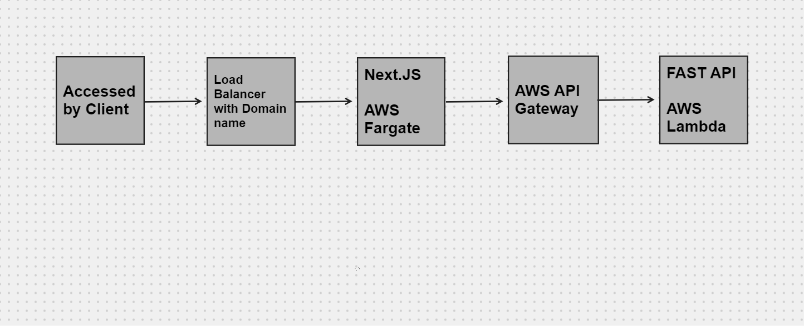
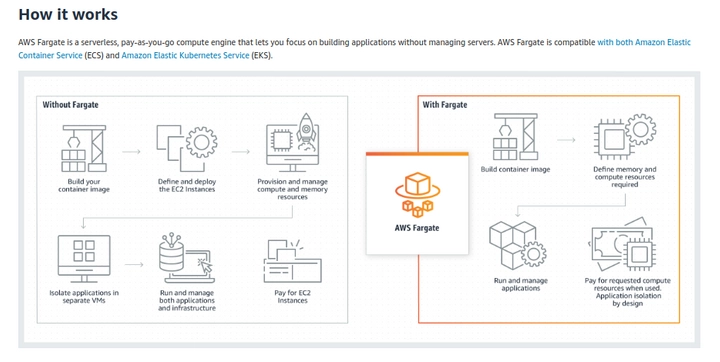
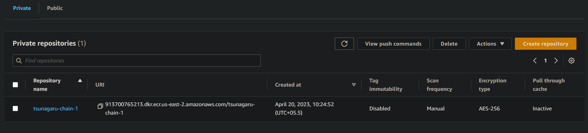
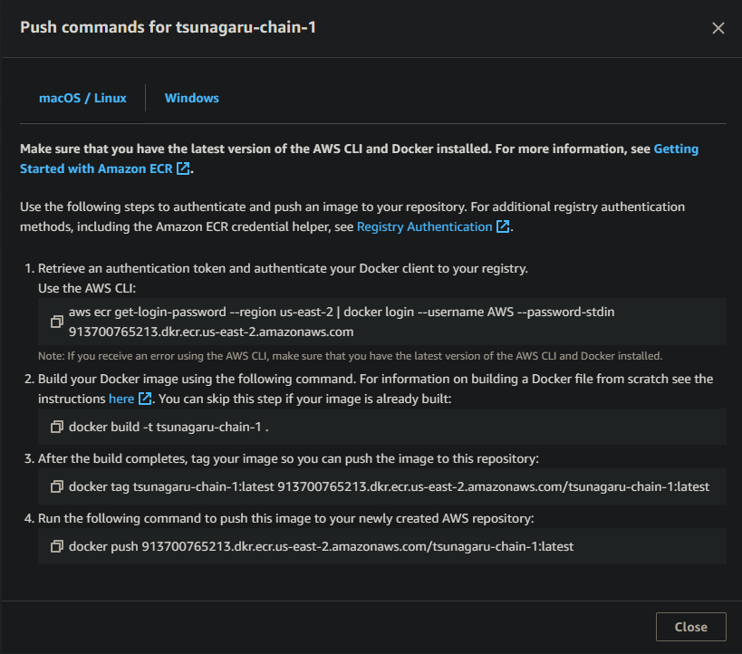
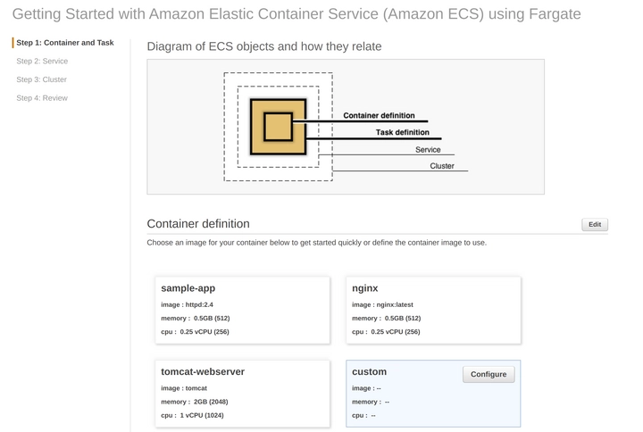
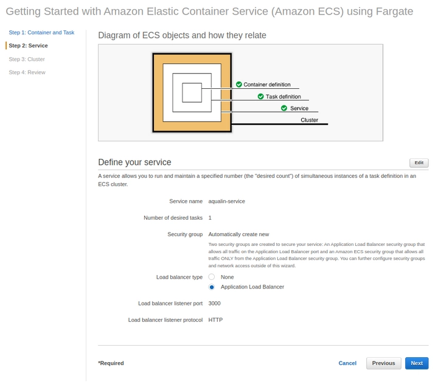

## Current Setup
--- 
## Setup EC2 Server
- Setup an EC2 server with the required vCPU and RAM on AWS (2CPU + 4G RAM current)
- Attach a elastic IP so that on server restart IP address does not change

## Set up continuous delivery pipelines using Github Actions
-   In our GitHub repository, we click on the **Action** tab and configure a new workflow. This has a created [main.yml](./main.yaml) file in ```.github/workflows```. Explainations are included in the yaml file
-  [Secrets](./secrets.png) are defined in the Github repo for the app 
-  Different workflow files for both frontend and backend
- Each time we push on dev in our project, this workflow runs and deploys our application


## Make the application publicly accessible

- Since we have not configured a domain, we use [ngrok](https://dashboard.ngrok.com/get-started/your-authtoken), make an account and get the auth token
- Configure the [ngrok.yml](./ngrok.yml)
- Start with ```ngrok start --all -config=ngrok.yml``` on the deployment folder


<br>
<br>

--- 
##  Future Plan


## [Frontend](./Frontend.md)
- We create a Docker image for our Next.JS app
- Using Aws Fargate 

#### Setting up AWS Fargate
- We create a container repository in AWS ECR (Elastic Container Repository)
- Creating a private repository for all the docker images
- Pushing the Docker image we built to the above created repo

- We go back to the ECS Clusters page and click on **Get started** to actually use AWS Fargate.
- On the **Container and Task** page, we  **Configure** a **Custom** container definition and add previous image URL
- In **Service** page we add an application load balancer(we can add a custom domain url to the load balancer later)


## Backend
- Create a Lambda function with Python (with magnum.io - useful for wrapping all fastAPI code for AWS Lambda)
- Create API Gateway for sending data requests to the backend 
- Deploy API 
- Upload fastAPI code as .zip to Lambda function
- [Deploy a FastAPI app in AWS Lambda - Guillaume Martin (guillaume-martin.github.io)](https://guillaume-martin.github.io/deploy-fastapi-on-aws-lambda.html) - use this api exposed here in the nextjs app
- [Mangum](https://mangum.io/) - to make fastapi work on lambda
- [Serverless](serverless.com) - deploy the code